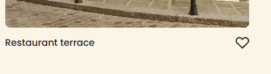

# Project 3: Spots

## Directory 

* Intro to Project
* What's involved  
  * Figma  
  * VS Code
  * CSS Techs 
* Features  
* Github Pages Link
* Video Link

### Intro to Project
  
Spots is a social media platform dedicated to connecting people of all backgrounds through the beauty of photos.
This project was a test in responsive design. Between blending flex and grid displays and media queries, the site can go from desktop to mobile with ease. 

### What's Involed

  
**Figma**  
  
Figma is a wonderful design tool that allows one to plan out their web design and share with a whole team to bring one's dreams to life. This software provides a visual key as well as measurements, element sizings, and more.
* [Link to the project on Figma](https://www.figma.com/file/BBNm2bC3lj8QQMHlnqRsga/Sprint-3-Project-%E2%80%94-Spots?type=design&node-id=2%3A60&mode=design&t=afgNFybdorZO6cQo-1)  
  
**VS Code**  
  
  All markup and styling was doen within this bit of software. A heandy interface that allows coding to be done easily. Add extensions, know when your git projects have been modified/ added to the *hub*/ haven't been tracked yet, as well as easily see all of your files in one simple gui.

**CSS Techs**

* display grid :: used with the image cards to make a more responsive platform.
* Media queries :: Used to scale the platform between desktop and mobile versions.
* Text overflow :: profile name and description is limited to three lines before text is hidden behind ellipsis. The same is true of image titles, only being hidden after a certain width is reached.
* practice with using less hard widths to make a more responsive site.

### Features

This site has the ability to scale between desktop and mobile. Along with this, it has two buttons customized with css that would allow a user to edit their profile and make a new post. Each image can be named and if a user so chooses, liked/ favorited for viewing pleasure later. 

### Github Pages Link

* [Spots on Github Pages](https://hellnwo.github.io/se_project_spots/)

### Video Link

* [Video on GDrive](https://drive.google.com/file/d/1MWsAXYJ4J80St6vQ3OYFkB9nAJtMdwNS/view?usp=sharing)